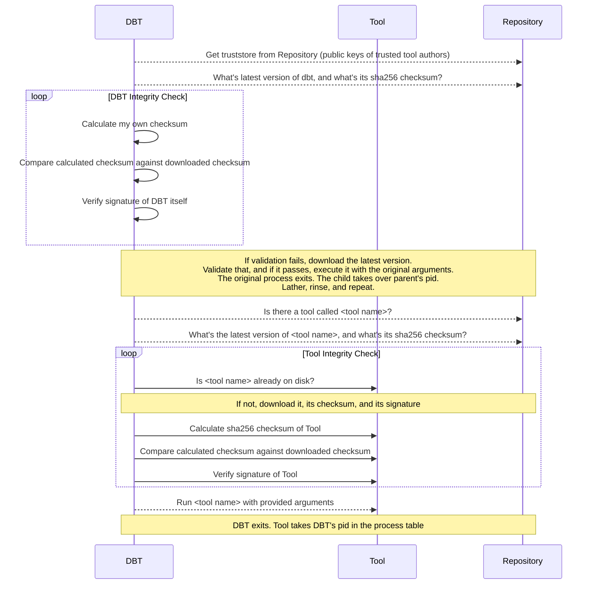

# DBT (Dynamic Binary Toolkit)

**A secure, self-updating binary distribution system for organizations.**

DBT automatically downloads, verifies, and runs signed executables from a trusted repository, ensuring your team always uses the latest, secure versions of your tools without manual intervention.

[](https://img.shields.io/github/release/nikogura/dbt.svg)
[](https://github.com/nikogura/dbt/actions/workflows/ci.yml)
[](https://goreportcard.com/report/github.com/nikogura/dbt)
[](http://godoc.org/github.com/nikogura/dbt/pkg/dbt)
[](https://codecov.io/gh/nikogura/dbt)
[](https://github.com/avelino/awesome-go)

## Key Benefits

- 🔄 **Self-updating**: Tools and DBT itself stay current automatically
- 🔐 **Cryptographically verified**: Every binary is signed and verified before execution  
- 📦 **Universal**: Distribute any single-file executable (Go, Python, scripts, etc.)
- 🎯 **Zero maintenance**: Users never need to manually update or verify tools
- 🔄 **Pull model**: Users get latest by default, can specify older versions when needed
- 🌐 **Cross-platform**: Works on Linux, macOS, and Windows

## Quick Start

1. **Install DBT**:
   ```bash
   curl https://your-dbt-repo.com/install_dbt.sh | bash
   ```

2. **List available tools**:
   ```bash
   dbt catalog list
   ```

3. **Run a tool**:
   ```bash
   dbt -- mytool arg1 arg2
   ```

That's it! DBT handles downloading, verification, and updates automatically.

## Requirements

- Go 1.19+ (for building from source)
- Linux, macOS, or Windows
- Network access to your repository
- PGP for signature verification

## Usage

Run tools using this format:
```bash
dbt [dbt-flags] -- <tool-name> [tool-args]
```

**Important**: The `--` separates DBT's flags from your tool's flags.

### Examples:
```bash
# Run 'mytool' with no flags
dbt -- mytool file.txt

# Run 'mytool' with tool flags  
dbt -- mytool --verbose file.txt

# Use specific tool version
dbt -v 1.2.3 -- mytool --help

# Verbose DBT output
dbt -V -- mytool file.txt
```

If your tool has no flags, only positional arguments, you can omit the `--`:
```bash
dbt mytool file.txt
```

## How DBT Works

DBT is a secure downloader and verifier for executable files. It ensures your organization's tools are always up-to-date, cryptographically verified, and safe to use.

### The Process

1. **Self-Update Check**: DBT first checks if it needs to update itself
2. **Tool Verification**: Downloads and verifies the requested tool's signature and checksum  
3. **Execution**: Runs the verified tool with your arguments, replacing itself in the process table

### Supported Tool Types

DBT can distribute any single-file executable:
- **Go binaries**: Native support with cross-compilation
- **Python tools**: Built with PyInstaller or PyOxidizer  
- **Shell scripts**: Any script with a detached signature
- **Other languages**: Any language that compiles to a single file

### Always Up-to-Date

- **Default behavior**: Automatically uses the latest version available
- **Version pinning**: Specify exact versions when needed (`dbt -v 1.2.3 -- tool`)
- **Graceful degradation**: Works offline with cached tools when repository is unavailable

## Installation

### Option 1: Use Pre-built Installer (Recommended)
```bash
curl https://your-dbt-repo.com/install_dbt.sh | bash
```

### Option 2: Build from Source
```bash
git clone https://github.com/nikogura/dbt.git
cd dbt
# Edit metadata.json with your repository URLs
go install github.com/nikogura/gomason@latest
gomason publish -sl
./install_dbt.sh
```

### Build Configuration

If building from source, edit `metadata.json` to configure your repositories:

```json
{
  "repository": "https://your-dbt-repo.com/dbt",
  "tool-repository": "https://your-dbt-repo.com/dbt-tools"
}
```

**Note**: S3 URLs must use virtual host format: `https://bucket.s3.region.amazonaws.com`

### Verify Installation
```bash
dbt catalog list
```

## Configuration

DBT uses a config file at `~/.dbt/conf/dbt.json`, created automatically by the installer:

```json
{
  "dbt": {
    "repository": "https://your-repo.com/dbt",
    "truststore": "https://your-repo.com/dbt/truststore"
  },
  "tools": {
    "repository": "https://your-repo.com/dbt-tools"
  },
  "username": "",
  "password": "",
  "usernamefunc": "echo $USERNAME",
  "passwordfunc": "echo $PASSWORD"
}
```

### Configuration Options

#### dbt section
- **repository**: URL of the trusted repository for DBT binaries
- **truststore**: URL containing public keys of trusted DBT binary authors

#### tools section  
- **repository**: URL where tools are stored and discovered

#### Authentication (Optional)
- **username/password**: Basic auth credentials
- **usernamefunc/passwordfunc**: Shell commands to retrieve credentials dynamically

### Trust Store Format

The truststore contains PGP public keys of trusted tool authors:

```
-----BEGIN PGP PUBLIC KEY BLOCK-----

mQENBFowLigBCAC++pVrVRRM86Wo8V7XJsOmU2xtBBY5a8ktB1tdpEhzlPWQHObx
...
=b72A
-----END PGP PUBLIC KEY BLOCK-----
```

Multiple keys can be concatenated. Comments between key blocks are ignored.

## Repository Support

DBT supports multiple repository backends:

### Built-in Reposerver
- Written in Go with multiple auth methods
- HTTP basic auth (htpasswd files)  
- SSH key-based JWT authentication
- Mixed auth (different methods for GET/PUT)

### Artifactory
- [Artifactory Open Source](https://www.jfrog.com/open-source) and paid versions
- Works with or without authentication

### Amazon S3
- Uses existing AWS credential configuration (`~/.aws/`)
- Supports credential managers via `credential_process`
- **Must use virtual host URLs**: `https://bucket.s3.region.amazonaws.com`

### Any WebDAV Server
- Standard HTTP/WebDAV servers work as repositories

## Security Model

DBT's security relies on proper repository and key management.

### How Security Works

DBT will only execute binaries that:
- Have valid cryptographic signatures from trusted keys
- Pass SHA256 checksum verification  
- Are downloaded from your configured trusted repository

If any verification fails, DBT stops immediately and reports the error.

### Best Practices

✅ **DO**:
- Use separate signing keys for different trust levels
- Implement proper repository access controls  
- Enable authentication for repository access
- Regularly rotate signing keys
- Use HTTPS for all repository communications

❌ **DON'T**:
- Share unencrypted signing keys
- Allow unauthorized repository writes
- Run DBT with overly permissive trust stores
- Expose repositories to the public internet without authentication

### Trust Model

> "DBT is as secure as the repository you trust and how well you protect your signing keys."

Failing to secure your repository and signing keys compromises your entire DBT deployment. You are responsible for implementing appropriate security measures.

## Why DBT?

### The Problem

Software distribution in organizations often involves:
- Manual updates that users forget or ignore
- Security verification that's too complex for regular use
- "Push model" updates that break workflows
- Complex MDM systems that are hard to maintain

### The Solution

DBT implements a "pull model" where:
- **Users get convenience**: Latest versions automatically, no manual updates
- **Administrators get security**: Cryptographic verification, controlled distribution  
- **Everyone gets flexibility**: Pin to specific versions when needed
- **Organizations get simplicity**: No complex MDM infrastructure required

### Real-World Use Cases

- **Enterprise tool distribution** without complex MDM systems
- **CI/CD pipelines** with always-current tooling
- **Development teams** wanting hassle-free tool management  
- **Dynamic environments** (containers, VMs) that need fresh tools on boot
- **Organizations** requiring cryptographic verification of all executables

## Included Tools

DBT includes several tools for common tasks:

### Catalog
Shows available tools in your repository.

```bash
dbt catalog list
```

Output:
```
Commands:
    Command Name        Latest Version      Description
    boilerplate         3.0.4              A tool boilerplate generating tool for DBT
    catalog             3.0.4              Tool for showing available DBT tools
    reposerver          3.0.4              A tool repository server for DBT
```

### Reposerver
HTTP repository server for hosting DBT tools and components.

```bash
dbt reposerver -f /path/to/config
```

**Auth Methods**:
- **basic-htpasswd**: Standard htpasswd files
- **ssh-agent-file**: JWT authentication with SSH keys from files
- **ssh-agent-func**: JWT authentication with SSH keys from shell functions

### Boilerplate  
Project template generator for creating new tools.

```bash
dbt boilerplate
```

Generates working project stubs with proper DBT integration.

## Advanced Topics

### Process Management

DBT uses an interesting process replacement mechanism:

1. Downloads and verifies the requested tool
2. Executes the tool with `exec()`, replacing DBT in the process table
3. The tool runs as if invoked directly - no wrapper process remains

This means tools running via DBT are indistinguishable from tools run directly.

### Offline Mode

When repositories are unreachable, DBT can:
- Use previously downloaded tools from cache
- Continue working with locally verified binaries
- Gracefully handle network outages

### Version Management

```bash
# Always get latest (default)
dbt -- tool args

# Pin to specific version
dbt -v 1.2.3 -- tool args

# List all available versions  
dbt catalog list -v
```

## Workflow Sequence



## Troubleshooting

### Common Issues

**"No such tool" error**:
- Check `dbt catalog list` to see available tools
- Verify your repository configuration in `~/.dbt/conf/dbt.json`

**Signature verification failed**:
- Ensure your truststore contains the correct public keys
- Check that tools are properly signed with trusted keys
- Verify the truststore URL is accessible

**Repository unreachable**:
- DBT can work offline with cached tools
- Check network connectivity and repository URL
- Verify authentication credentials if required

**Tool won't update**:
- DBT checks for updates on each run by default
- Use `dbt -V` for verbose output to see what's happening
- Check repository permissions and connectivity

**Permission denied**:
- Ensure DBT binary has execute permissions
- Check that `~/.dbt/` directory is writable
- Verify tool cache directory permissions

### Debug Mode

Run with verbose output to diagnose issues:
```bash
dbt -V -- tool args
```

This shows:
- Repository communication
- Download progress  
- Verification steps
- Error details

## Contributing

DBT is designed to be extensible. Create your own tools by:

1. Building single-file executables
2. Signing them with your trusted key
3. Publishing to your repository
4. Users automatically get access via `dbt catalog list`

For template-based tool creation, use:
```bash
dbt boilerplate
```

## License

Licensed under the Apache License, Version 2.0. See LICENSE file for details.