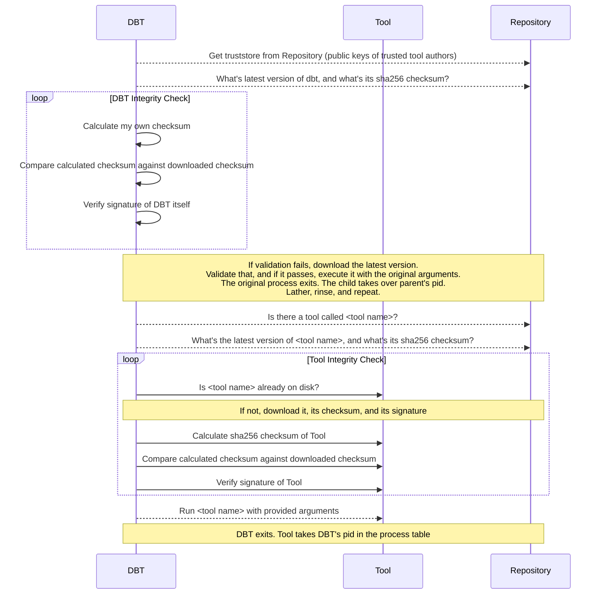

# DBT (Dynamic Binary Toolkit)

**A secure, self-updating binary distribution system for organizations.**

DBT automatically downloads, verifies, and runs signed executables from a trusted repository, ensuring your team always uses the latest, secure versions of your tools without manual intervention.

[](https://img.shields.io/github/release/nikogura/dbt.svg)
[](https://github.com/nikogura/dbt/actions/workflows/ci.yml)
[](https://goreportcard.com/report/github.com/nikogura/dbt)
[](http://godoc.org/github.com/nikogura/dbt/pkg/dbt)
[](https://codecov.io/gh/nikogura/dbt)
[](https://github.com/avelino/awesome-go)

## How It Works

DBT is a secure downloader and verifier for executable files.  When a user runs a tool through DBT:

1. **Self-update**: DBT checks if it needs to update itself
2. **Download**: Fetches the requested tool from your repository
3. **Verify**: Checks the SHA256 checksum and GPG signature against your truststore
4. **Execute**: Runs the verified tool, replacing itself in the process table

If any verification step fails, DBT stops immediately and reports the error.  No unverified code ever runs.



DBT can distribute any single-file executable: Go binaries, Python tools built with PyInstaller, shell scripts with detached signatures, or anything else that compiles to a single file.

## Why DBT?

Software distribution in organizations often involves manual updates users forget, security verification that's too complex for regular use, and "push model" updates that break workflows.

DBT implements a "pull model" where users get the latest version automatically, administrators get cryptographic verification and controlled distribution, and organizations avoid complex MDM infrastructure.  Users can pin to specific versions when needed (`dbt -v 1.2.3 -- tool`).

## Setting Up DBT

Setting up DBT for your organization requires four steps:

1. **Deploy a repository** — somewhere to store your binaries
2. **Create your signing keys** — GPG keys for artifact verification
3. **Publish DBT itself** — get dbt and catalog onto your repository
4. **Build your organization's installer** — a single binary that bootstraps users

### Step 1: Deploy a Repository

DBT needs a file server that supports HTTP GET (for downloads) and ideally HTTP PUT (for publishing).  There are several options.

#### Option A: Kubernetes Reposerver (Recommended)

The built-in reposerver is a purpose-built Go HTTP server with authentication, and ships as a distroless container image.  Kustomize manifests are included in the `kubernetes/` directory.

```bash
# Deploy the base configuration
kubectl apply -k kubernetes/base

# Or create a customized overlay (recommended)
cp -r kubernetes/overlays/example kubernetes/overlays/myenv
# Edit kubernetes/overlays/myenv/kustomization.yaml and reposerver.json
kubectl apply -k kubernetes/overlays/myenv
```

Set the reposerver version in your overlay's `kustomization.yaml`:

```yaml
images:
  - name: ghcr.io/nikogura/dbt-reposerver
    newTag: "3.7.16"
```

The base deployment creates a StatefulSet with a 10Gi PersistentVolumeClaim.  Adjust the size in your overlay to fit your artifact volume.

See `kubernetes/README.md` for the full Kubernetes deployment guide, including ingress configuration and WAF considerations.

#### Option B: Docker

Run the reposerver directly with Docker for development or small deployments:

```bash
# Run with default settings (serves /var/dbt on port 9999)
docker run -d -p 9999:9999 \
  -v /path/to/repo:/var/dbt \
  ghcr.io/nikogura/dbt-reposerver:latest

# Run with a config file for authentication
docker run -d -p 9999:9999 \
  -v /path/to/repo:/var/dbt \
  -v /path/to/config.json:/etc/dbt/reposerver.json \
  ghcr.io/nikogura/dbt-reposerver:latest \
  -a 0.0.0.0 -p 9999 -r /var/dbt -f /etc/dbt/reposerver.json
```

**Command-line flags** (passed after the image name):
- `-a`: Listen address (default: `0.0.0.0`)
- `-p`: Listen port (default: `9999`)
- `-r`: Server root directory (default: `/var/dbt`)
- `-f`: Config file path (optional, required for authentication)

This is a distroless image with no shell.  Configuration is done via command-line flags, environment variables, or a config file.

#### Environment Variable Configuration

The reposerver can be configured entirely via `REPOSERVER_` environment variables, removing the need for a JSON config file.  This is the idiomatic approach for container deployments.

Priority order: **config file (`-f`)** > **CLI flags (`-a`, `-p`, `-r`)** > **environment variables**.

| Variable | Default | Description |
|----------|---------|-------------|
| `REPOSERVER_ADDRESS` | `0.0.0.0` | Listen address |
| `REPOSERVER_PORT` | `9999` | Listen port |
| `REPOSERVER_ROOT` | _(empty)_ | Server root directory |
| `REPOSERVER_AUTH_GETS` | `false` | Require auth for GET requests |
| `REPOSERVER_AUTH_TYPE_GET` | _(empty)_ | Auth method for GET (e.g. `oidc`, `static-token`) |
| `REPOSERVER_AUTH_TYPE_PUT` | _(empty)_ | Auth method for PUT (comma-separated for multi-auth) |
| `REPOSERVER_IDP_FILE_GET` | _(empty)_ | Identity provider file for GET auth |
| `REPOSERVER_IDP_FILE_PUT` | _(empty)_ | Identity provider file for PUT auth |
| `REPOSERVER_IDP_FUNC_GET` | _(empty)_ | Identity provider function for GET auth |
| `REPOSERVER_IDP_FUNC_PUT` | _(empty)_ | Identity provider function for PUT auth |
| `REPOSERVER_STATIC_TOKEN_GET` | _(empty)_ | Static bearer token for GET auth |
| `REPOSERVER_STATIC_TOKEN_PUT` | _(empty)_ | Static bearer token for PUT auth |
| `REPOSERVER_OIDC_ISSUER_URL_GET` | _(empty)_ | OIDC issuer URL for GET |
| `REPOSERVER_OIDC_AUDIENCES_GET` | _(empty)_ | OIDC audiences for GET (comma-separated) |
| `REPOSERVER_OIDC_USERNAME_CLAIM_GET` | _(empty)_ | OIDC username claim for GET |
| `REPOSERVER_OIDC_ALLOWED_GROUPS_GET` | _(empty)_ | Allowed OIDC groups for GET (comma-separated) |
| `REPOSERVER_OIDC_SKIP_ISSUER_VERIFY_GET` | `false` | Skip OIDC issuer verification for GET |
| `REPOSERVER_OIDC_JWKS_CACHE_GET` | `0` | JWKS cache seconds for GET |
| `REPOSERVER_OIDC_ISSUER_URL_PUT` | _(empty)_ | OIDC issuer URL for PUT |
| `REPOSERVER_OIDC_AUDIENCES_PUT` | _(empty)_ | OIDC audiences for PUT (comma-separated) |
| `REPOSERVER_OIDC_USERNAME_CLAIM_PUT` | _(empty)_ | OIDC username claim for PUT |
| `REPOSERVER_OIDC_ALLOWED_GROUPS_PUT` | _(empty)_ | Allowed OIDC groups for PUT (comma-separated) |
| `REPOSERVER_OIDC_SKIP_ISSUER_VERIFY_PUT` | `false` | Skip OIDC issuer verification for PUT |
| `REPOSERVER_OIDC_JWKS_CACHE_PUT` | `0` | JWKS cache seconds for PUT |

**Kubernetes example — no ConfigMap needed:**

```yaml
containers:
  - name: reposerver
    image: ghcr.io/nikogura/dbt-reposerver:latest
    env:
      - name: REPOSERVER_ADDRESS
        value: "0.0.0.0"
      - name: REPOSERVER_PORT
        value: "9999"
      - name: REPOSERVER_ROOT
        value: "/var/dbt"
      - name: REPOSERVER_AUTH_TYPE_PUT
        value: "static-token"
      - name: REPOSERVER_STATIC_TOKEN_PUT
        valueFrom:
          secretKeyRef:
            name: dbt-reposerver
            key: publish-token
```

**Docker example:**

```bash
docker run -d -p 9999:9999 \
  -v /path/to/repo:/var/dbt \
  -e REPOSERVER_ROOT=/var/dbt \
  -e REPOSERVER_AUTH_TYPE_PUT=static-token \
  -e REPOSERVER_STATIC_TOKEN_PUT=my-secret-token \
  ghcr.io/nikogura/dbt-reposerver:latest
```

#### Option C: Amazon S3

Use an S3 bucket as a repository.  No server to run — publishing is done with the AWS CLI, and DBT reads directly from S3 using standard AWS credentials.

```bash
# Create the bucket
aws s3 mb s3://my-dbt-repo

# S3 URLs must use virtual host format in DBT config:
# https://my-dbt-repo.s3.us-east-1.amazonaws.com
```

S3 authentication uses your existing AWS credential configuration (`~/.aws/`, environment variables, IAM roles, or `credential_process`).

#### Option D: Artifactory or Any WebDAV Server

Any server that supports HTTP GET and PUT works as a DBT repository.  [Artifactory Open Source](https://www.jfrog.com/open-source), Apache with WebDAV, nginx with dav module — all are viable options.

### Step 2: Secure Your Repository

> "DBT is as secure as the repository you trust and how well you protect your signing keys."

If your repository is the reposerver (options A or B above), you should configure authentication.  The reposerver supports separate auth methods for read (GET) and write (PUT/DELETE) operations.

#### Choosing an Auth Method

| Method | Best For | Config Value |
|--------|----------|--------------|
| **SSH-OIDC** (Recommended) | Passwordless CLI auth via SSH keys + Dex — no browser, no passwords | `oidc` |
| **Static token** | CI/CD pipelines, automated publishing | `static-token` |
| **SSH-agent JWT** | Direct SSH key verification without an OIDC provider | `ssh-agent-file` |
| **Basic auth (htpasswd)** | Small teams, simple setups | `basic-htpasswd` |
| **Browser-based OIDC** | Keycloak, Okta, Auth0 (requires browser redirect — poor CLI UX) | `oidc` |

You can combine multiple methods.  For example, OIDC for user downloads and a static token for CI/CD publishing.  Separate multiple auth types with commas: `"authTypePut": "static-token,oidc"`.

#### Example: Open Reads, Token-Protected Writes

The simplest production setup — anyone can download tools, but publishing requires a token:

```json
{
  "address": "0.0.0.0",
  "port": 9999,
  "serverRoot": "/var/dbt",
  "authGets": false,
  "authTypePut": "static-token",
  "authOptsPut": {
    "staticTokenEnv": "DBT_PUBLISH_TOKEN"
  }
}
```

Set the `DBT_PUBLISH_TOKEN` environment variable on the reposerver container.  Clients publish using `Authorization: Bearer <token>`.

The `staticTokenEnv` field reads the token from an environment variable (recommended).  You can also use `staticToken` to set the value directly in config, but environment variables are safer for production.

#### Example: OIDC for Everything

Full OIDC authentication for both reads and writes, with group-based authorization for publishing:

```json
{
  "address": "0.0.0.0",
  "port": 9999,
  "serverRoot": "/var/dbt",
  "authGets": true,
  "authTypeGet": "oidc",
  "authOptsGet": {
    "oidc": {
      "issuerUrl": "https://dex.example.com",
      "audiences": ["dbt-server"],
      "usernameClaimKey": "email"
    }
  },
  "authTypePut": "oidc",
  "authOptsPut": {
    "oidc": {
      "issuerUrl": "https://dex.example.com",
      "audiences": ["dbt-server"],
      "usernameClaimKey": "email",
      "allowedGroups": ["dbt-publishers"]
    }
  }
}
```

**OIDC options:**
- **issuerUrl**: OIDC provider URL (fetches `.well-known/openid-configuration` automatically)
- **audiences**: Expected `aud` claims in tokens
- **usernameClaimKey**: Claim to extract the username from (`sub`, `email`, `preferred_username`, or `name`)
- **allowedGroups**: Groups authorized to access (empty = all authenticated users)
- **requiredClaims**: Additional claims that must match exactly

This works with any OIDC provider: Dex, Keycloak, Okta, Auth0, etc.

#### Example: OIDC Reads + Token Writes (Recommended for CI/CD)

Users authenticate via OIDC to download tools.  CI/CD publishes via static token:

```json
{
  "address": "0.0.0.0",
  "port": 9999,
  "serverRoot": "/var/dbt",
  "authGets": true,
  "authTypeGet": "oidc",
  "authOptsGet": {
    "oidc": {
      "issuerUrl": "https://dex.example.com",
      "audiences": ["dbt-server"]
    }
  },
  "authTypePut": "static-token",
  "authOptsPut": {
    "staticTokenEnv": "DBT_PUBLISH_TOKEN"
  }
}
```

#### Example: Basic Auth (htpasswd)

For small teams or environments without an identity provider:

```json
{
  "address": "0.0.0.0",
  "port": 9999,
  "serverRoot": "/var/dbt",
  "authGets": false,
  "authTypePut": "basic-htpasswd",
  "authOptsPut": {
    "idpFile": "/etc/dbt/htpasswd"
  }
}
```

Generate the htpasswd file with: `htpasswd -c /etc/dbt/htpasswd username`

#### S3 Security

For S3 repositories, security is handled by AWS IAM.  Use IAM policies to control who can read from and write to the bucket.

### Step 3: Create Your Signing Keys

DBT verifies every binary using GPG signatures.  You need a GPG key to sign artifacts and a **truststore** containing the public key for clients to verify against.

#### Generate a Signing Key

```bash
# Generate a new key (use your organization's email)
gpg --full-generate-key

# List your keys to find the key ID
gpg --list-secret-keys --keyid-format long
```

#### Create the Truststore

The truststore is a file containing one or more PGP public keys in ASCII-armored format.  DBT clients download this file and use it to verify signatures.

```bash
# Export your public key
gpg --armor --export your-email@example.com > truststore

# Multiple signers? Concatenate their public keys:
gpg --armor --export signer1@example.com >> truststore
gpg --armor --export signer2@example.com >> truststore
```

#### Upload the Truststore to Your Repository

The truststore must be accessible at the `truststore` path relative to your dbt repository URL.

**For the reposerver (HTTP PUT):**

```bash
curl -X PUT \
  -H "Authorization: Bearer $DBT_PUBLISH_TOKEN" \
  --data-binary @truststore \
  https://dbt.example.com/dbt/truststore
```

**For S3:**

```bash
aws s3 cp truststore s3://my-dbt-repo/dbt/truststore
```

**For a plain filesystem (Docker volume, NFS, etc.):**

```bash
cp truststore /path/to/repo/dbt/truststore
```

#### Protect Your Signing Key

Your signing key is the root of trust for your entire DBT deployment.  If it is compromised, an attacker can sign malicious binaries that all your users will trust.

- Store the private key in a secrets manager or hardware security module
- Never commit it to Git unencrypted
- For CI/CD, store it as a base64-encoded secret and import it at runtime:

```bash
echo -n "$GPG_SIGNING_KEY" | base64 -d | gpg --batch --import
```

### Step 4: Publish DBT to Your Repository

Your repository needs dbt and catalog binaries before users can install anything.  The easiest way is to republish the upstream releases from GitHub.

#### Repository Directory Layout

The reposerver expects this directory structure under its server root (`/var/dbt` by default):

```
/var/dbt/
├── dbt/
│   ├── truststore                           # GPG public keys
│   ├── <version>/
│   │   └── <os>/<arch>/
│   │       ├── dbt                          # Binary
│   │       ├── dbt.asc                      # GPG signature
│   │       └── dbt.sha256                   # SHA256 checksum
│   └── installer/
│       └── <os>/<arch>/
│           └── dbt-installer                # Pre-built installer
└── dbt-tools/
    └── <toolname>/
        └── <version>/
            ├── description.txt              # Tool description (shown in catalog)
            ├── description.txt.asc
            └── <os>/<arch>/
                ├── <toolname>               # Binary
                ├── <toolname>.asc           # GPG signature
                ├── <toolname>.sha256        # SHA256 checksum
                └── <toolname>.md5           # MD5 checksum (optional)
```

#### Path Separation: `/dbt/` vs `/dbt-tools/`

The two top-level directories serve different trust levels:

- **`/dbt/`** contains dbt itself and the truststore.  These are the root of trust — if either is compromised, all downstream tool verification is meaningless.  Only administrators should have write access to this path.
- **`/dbt-tools/`** contains tools published by developers.  Because every tool is verified against the truststore (which lives under `/dbt/`), publishing a tool does not grant trust — the tool's GPG signature must still match a key in the truststore.

This separation enables **delegated publishing**: administrators gate dbt and the truststore, while developers publish their own tools independently.  The two paths can be served from different backends entirely — different servers, different S3 buckets, or different auth policies.  The client `toolsRepository` config field controls where tools are fetched from, independent of the dbt repository URL.

#### Option A: Downstream Publishing Script (Recommended)

The `scripts/publish-downstream.sh` script downloads the latest release from GitHub, signs each artifact with your GPG key, and uploads everything to your repository:

```bash
# Bearer token auth (CI/CD)
./scripts/publish-downstream.sh \
  --http https://dbt.example.com \
  --auth bearer --token "$DBT_PUBLISH_TOKEN" \
  -y

# Specific version
./scripts/publish-downstream.sh \
  --http https://dbt.example.com \
  --auth bearer --token "$DBT_PUBLISH_TOKEN" \
  -v 3.7.16 -y

# Publish to S3 instead
export DBT_S3_BUCKET="my-dbt-repo"
export TOOLS_S3_BUCKET="my-dbt-tools-repo"
export S3_REGION="us-east-1"
./scripts/publish-downstream.sh --s3 -v 3.7.16 -y

# Dry run (see what would be published)
./scripts/publish-downstream.sh \
  --http https://dbt.example.com \
  --auth bearer --token "$DBT_PUBLISH_TOKEN" -d
```

**Authentication options for the script:**

| Method | Flag | Description |
|--------|------|-------------|
| Bearer token | `--auth bearer --token TOKEN` | Static token (CI/CD pipelines) |
| OIDC | `--auth oidc --oidc-issuer URL` | Interactive authentication |
| Basic auth | `--auth basic` | Username/password (via env vars) |
| None | `--auth none` | No authentication (unsecured repos) |

**Requirements:** `curl`, `jq`, `gpg`.  For S3: `aws` CLI.

The script publishes dbt binaries, catalog binaries, installer scripts, and (if built) pre-built installer binaries for all supported platforms.

#### Option B: Manual Upload (curl)

Upload individual artifacts directly:

```bash
VERSION="3.7.16"
PLATFORM="linux/amd64"

# Sign the binary
gpg --detach-sign --armor dbt

# Generate checksum
sha256sum dbt | cut -d' ' -f1 > dbt.sha256

# Upload binary, signature, and checksum
curl -X PUT -H "Authorization: Bearer $TOKEN" --data-binary @dbt \
  https://dbt.example.com/dbt/$VERSION/$PLATFORM/dbt

curl -X PUT -H "Authorization: Bearer $TOKEN" --data-binary @dbt.asc \
  https://dbt.example.com/dbt/$VERSION/$PLATFORM/dbt.asc

curl -X PUT -H "Authorization: Bearer $TOKEN" --data-binary @dbt.sha256 \
  https://dbt.example.com/dbt/$VERSION/$PLATFORM/dbt.sha256
```

Repeat for each platform (`linux/amd64`, `darwin/amd64`, `darwin/arm64`) and for the catalog tool under `/dbt-tools/catalog/`.

#### Option C: Gomason

[Gomason](https://github.com/nikogura/gomason) can build, sign, and publish DBT from source in a single command.  This is useful if you are maintaining a fork of DBT:

```bash
go install github.com/nikogura/gomason@latest
gomason publish
```

Gomason uses a `metadata.json` file (kept out of Git via `.gitignore`) to configure your repository URL and version.  See the Gomason documentation for details.

### Step 5: Build Your Organization's Installer

The installer is a standalone binary with your organization's repository URL and authentication settings baked in.  Users download it, run it, and they're configured — no manual setup.

#### Build with Make

```bash
make build-installer \
  SERVER_URL=https://dbt.example.com \
  SERVER_NAME=prod \
  INSTALLER_VERSION=3.7.16
```

For repositories with OIDC authentication:

```bash
make build-installer \
  SERVER_URL=https://dbt.example.com \
  SERVER_NAME=prod \
  ISSUER_URL=https://dex.example.com \
  OIDC_AUDIENCE=https://dbt.example.com \
  OIDC_CLIENT_ID=dbt-ssh \
  CONNECTOR_ID=ssh \
  INSTALLER_VERSION=3.7.16
```

For S3 repositories:

```bash
make build-installer \
  SERVER_URL=s3://my-dbt-repo \
  SERVER_NAME=prod \
  TOOLS_URL=s3://my-dbt-tools-repo \
  S3_REGION=us-east-1 \
  INSTALLER_VERSION=3.7.16
```

This creates platform-specific binaries in `dist/installer/`:

```
dist/installer/
├── darwin/amd64/dbt-installer
├── darwin/arm64/dbt-installer
└── linux/amd64/dbt-installer
```

#### Build Variables

| Variable | Required | Description |
|----------|----------|-------------|
| `SERVER_URL` | Yes | Base URL of dbt repository (`https://...` or `s3://...`) |
| `SERVER_NAME` | No | Alias for this server in config (defaults to hostname) |
| `TOOLS_URL` | No | Tools repository URL (defaults to `SERVER_URL/dbt-tools`) |
| `ISSUER_URL` | No | OIDC issuer URL (enables OIDC auth) |
| `OIDC_AUDIENCE` | No | OIDC token audience (defaults to `SERVER_URL`) |
| `OIDC_CLIENT_ID` | No | OAuth2 client ID (defaults to `dbt-ssh` for SSH-OIDC) |
| `OIDC_CLIENT_SECRET` | No | OAuth2 client secret (if required) |
| `CONNECTOR_ID` | No | OIDC connector ID (`ssh` for SSH-OIDC with Dex) |
| `S3_REGION` | No | AWS region for S3 (auto-detected if not set) |
| `INSTALLER_VERSION` | No | Version string embedded in the installer |

#### Distribute the Installer

The recommended approach is to maintain a **downstream repository** (see `examples/downstream-repo/`) with CI that automatically builds installers and publishes them as GitHub releases.  Direct your team to the releases page:

```
https://github.com/your-org/dbt/releases/latest
```

Users download the installer for their platform and run it.  Alternatively, publish the installer binaries to your reposerver (the downstream script does this automatically) or distribute them however makes sense for your organization.

The installer:
1. Authenticates to your repository (prompts for OIDC username if configured)
2. Downloads and verifies the latest dbt binary
3. Installs dbt to `~/.local/bin/dbt`
4. Creates `~/.dbt/conf/dbt.json` with your server configuration
5. Offers to add `~/.local/bin` to the user's shell profile

#### Build from Source (Alternative)

Users can also install from source without the installer:

```bash
git clone https://github.com/nikogura/dbt.git
cd dbt
go build -o dbt ./cmd/dbt
go build -o catalog ./cmd/catalog
```

This requires manual configuration of `~/.dbt/conf/dbt.json` (see [Client Configuration](#client-configuration)).

## Using DBT

Once installed, users interact with dbt like this:

```bash
# Run a tool (positional arguments only — no -- needed)
dbt mytool arg1 arg2

# Run a tool with flags (-- separates dbt flags from tool flags)
dbt -- mytool --verbose file.txt

# Use a specific tool version
dbt -v 1.2.3 -- mytool --help

# Verbose dbt output (for debugging)
dbt -V -- mytool file.txt

# List available tools
dbt catalog list

# Select a specific server (multi-server config)
dbt -s dev catalog list

# Offline mode (use cached tools)
dbt -o mytool file.txt
```

The `--` separator is only needed when the tool has flags (like `--verbose` or `--help`) that could be confused with dbt's own flags.  When a tool takes only positional arguments, `--` is unnecessary.

DBT checks for updates on every invocation by default.  When the repository is unreachable, it falls back to cached tools.

## Publishing Your Own Tools

Any single-file executable can be distributed through DBT.  The process is:

1. **Build** your tool for each target platform
2. **Sign** each binary with your GPG key
3. **Generate checksums** for each binary
4. **Upload** the binary, signature, checksum, and a description file to your repository

### Manual Publishing (curl)

Build your tool for each platform, then sign and upload:

```bash
# Sign
gpg --detach-sign --armor mytool

# Checksum
sha256sum mytool | cut -d' ' -f1 > mytool.sha256

# Upload (repeat for each platform)
curl -X PUT -H "Authorization: Bearer $TOKEN" \
  --data-binary @mytool \
  https://dbt.example.com/dbt-tools/mytool/1.0.0/linux/amd64/mytool

curl -X PUT -H "Authorization: Bearer $TOKEN" \
  --data-binary @mytool.asc \
  https://dbt.example.com/dbt-tools/mytool/1.0.0/linux/amd64/mytool.asc

curl -X PUT -H "Authorization: Bearer $TOKEN" \
  --data-binary @mytool.sha256 \
  https://dbt.example.com/dbt-tools/mytool/1.0.0/linux/amd64/mytool.sha256

# Upload the tool description (shown in `dbt catalog list`)
echo "My custom tool for doing things" | curl -X PUT \
  -H "Authorization: Bearer $TOKEN" \
  --data-binary @- \
  https://dbt.example.com/dbt-tools/mytool/1.0.0/description.txt
```

### Using Gomason

For Go projects, [Gomason](https://github.com/nikogura/gomason) can handle the entire build-sign-publish pipeline:

```bash
go install github.com/nikogura/gomason@latest
gomason publish
```

### Using Boilerplate

The [Boilerplate](https://github.com/nikogura/boilerplate) project generates working project stubs with proper DBT integration:

```bash
go install github.com/nikogura/boilerplate@latest
boilerplate
```

### Ensuring Your Public Key is in the Truststore

For users to run your tool, your GPG public key must be in the repository's truststore.  If it's not already there:

```bash
# Export your public key
gpg --armor --export your-email@example.com > my-key.asc

# Append to existing truststore
curl -s https://dbt.example.com/dbt/truststore > truststore
cat my-key.asc >> truststore

# Upload the updated truststore
curl -X PUT -H "Authorization: Bearer $TOKEN" \
  --data-binary @truststore \
  https://dbt.example.com/dbt/truststore
```

## Client Configuration

DBT uses a config file at `~/.dbt/conf/dbt.json`, created automatically by the installer.  If you need to configure it manually:

### Multi-Server Configuration (Recommended)

```json
{
  "servers": {
    "prod": {
      "repository": "https://dbt.prod.example.com/dbt",
      "truststore": "https://dbt.prod.example.com/dbt/truststore",
      "toolsRepository": "https://dbt.prod.example.com/dbt-tools",
      "authType": "oidc",
      "issuerUrl": "https://dex.example.com",
      "oidcAudience": "https://dbt.prod.example.com",
      "oidcClientId": "dbt-ssh",
      "oidcUsername": "jdoe",
      "connectorId": "ssh"
    },
    "dev": {
      "repository": "https://dbt.dev.example.com/dbt",
      "truststore": "https://dbt.dev.example.com/dbt/truststore",
      "toolsRepository": "https://dbt.dev.example.com/dbt-tools"
    },
    "s3": {
      "repository": "https://my-bucket.s3.us-east-1.amazonaws.com",
      "truststore": "https://my-bucket.s3.us-east-1.amazonaws.com/truststore",
      "toolsRepository": "https://my-tools-bucket.s3.us-east-1.amazonaws.com"
    }
  },
  "defaultServer": "prod"
}
```

**Server selection priority:**
1. CLI flag: `dbt -s dev catalog list`
2. Environment variable: `DBT_SERVER=dev dbt catalog list`
3. Config default: `defaultServer` field
4. First server in the map

#### Per-Server Fields

| Field | Description |
|-------|-------------|
| `repository` | URL of the dbt binary repository |
| `truststore` | URL containing public keys of trusted authors |
| `toolsRepository` | URL where tools are stored |
| `authType` | Set to `"oidc"` to enable OIDC authentication |
| `issuerUrl` | OIDC provider URL for token exchange |
| `oidcAudience` | Target audience for OIDC tokens |
| `oidcClientId` | OAuth2 client ID |
| `oidcClientSecret` | OAuth2 client secret (if required) |
| `oidcUsername` | Username for OIDC authentication |
| `connectorId` | Connector ID (e.g., `"ssh"` for Dex SSH-OIDC) |

### Legacy Single-Server Configuration

The legacy format is still supported for backward compatibility:

```json
{
  "dbt": {
    "repository": "https://your-repo.com/dbt",
    "truststore": "https://your-repo.com/dbt/truststore"
  },
  "tools": {
    "repository": "https://your-repo.com/dbt-tools"
  },
  "username": "",
  "password": "",
  "usernamefunc": "echo $USERNAME",
  "passwordfunc": "echo $PASSWORD"
}
```

### OIDC Client Authentication

DBT supports two OIDC authentication flows:

**SSH-OIDC (Dex with SSH connector):** DBT creates a JWT signed by your SSH key (via ssh-agent), then exchanges it with Dex for an OIDC token via RFC 8693 token exchange.  This requires no browser — authentication happens entirely on the command line.

```json
{
  "authType": "oidc",
  "issuerUrl": "https://dex.example.com",
  "oidcAudience": "dbt-server",
  "connectorId": "ssh"
}
```

The `connectorId` field routes the token exchange to Dex's SSH connector.  Set it to `"ssh"` when using Dex, or omit it for other OIDC providers that support RFC 8693 natively.

**Standard OIDC (Keycloak, Okta, etc.):** For providers that support RFC 8693 token exchange without a connector:

```json
{
  "authType": "oidc",
  "issuerUrl": "https://keycloak.example.com/realms/myrealm",
  "oidcAudience": "dbt-server"
}
```

## Reposerver Authentication Reference

Complete examples for every supported auth combination.

### OIDC with Keycloak

**Server:**
```json
{
  "address": "0.0.0.0",
  "port": 9999,
  "serverRoot": "/var/dbt",
  "authGets": true,
  "authTypeGet": "oidc",
  "authOptsGet": {
    "oidc": {
      "issuerUrl": "https://keycloak.example.com/realms/myrealm",
      "audiences": ["dbt-server"],
      "usernameClaimKey": "preferred_username"
    }
  },
  "authTypePut": "oidc",
  "authOptsPut": {
    "oidc": {
      "issuerUrl": "https://keycloak.example.com/realms/myrealm",
      "audiences": ["dbt-server"],
      "usernameClaimKey": "preferred_username",
      "allowedGroups": ["/dbt-publishers"]
    }
  }
}
```

**Client:**
```json
{
  "dbt": {
    "repository": "https://dbt.example.com/dbt",
    "truststore": "https://dbt.example.com/dbt/truststore"
  },
  "tools": {
    "repository": "https://dbt.example.com/dbt-tools"
  },
  "authType": "oidc",
  "issuerUrl": "https://keycloak.example.com/realms/myrealm",
  "oidcAudience": "dbt-server"
}
```

### Mixed Auth (OIDC Reads, SSH-Agent Writes)

```json
{
  "address": "0.0.0.0",
  "port": 9999,
  "serverRoot": "/var/dbt",
  "authGets": true,
  "authTypeGet": "oidc",
  "authOptsGet": {
    "oidc": {
      "issuerUrl": "https://dex.example.com",
      "audiences": ["dbt-server"]
    }
  },
  "authTypePut": "ssh-agent-file",
  "authOptsPut": {
    "idpFile": "/etc/dbt/pubkeys.json"
  }
}
```

### SSH-Agent JWT (Direct Verification)

SSH-agent authentication without an OIDC provider.  The reposerver verifies SSH key signatures directly against a list of authorized public keys:

```json
{
  "address": "0.0.0.0",
  "port": 9999,
  "serverRoot": "/var/dbt",
  "authTypePut": "ssh-agent-file",
  "authOptsPut": {
    "idpFile": "/etc/dbt/pubkeys.json"
  }
}
```

### Multi-Auth (Multiple Methods Simultaneously)

Accept multiple auth methods for the same operation.  The reposerver tries each method in order and accepts the first one that succeeds:

```json
{
  "address": "0.0.0.0",
  "port": 9999,
  "serverRoot": "/var/dbt",
  "authGets": true,
  "authTypeGet": "static-token,oidc,basic-htpasswd",
  "authOptsGet": {
    "staticToken": "read-token-value",
    "oidc": {
      "issuerUrl": "https://dex.example.com",
      "audiences": ["dbt-server"]
    },
    "idpFile": "/etc/dbt/htpasswd"
  },
  "authTypePut": "static-token,oidc",
  "authOptsPut": {
    "staticTokenEnv": "DBT_PUBLISH_TOKEN",
    "oidc": {
      "issuerUrl": "https://dex.example.com",
      "audiences": ["dbt-server"],
      "allowedGroups": ["dbt-publishers"]
    }
  }
}
```

## Security Model

### What DBT Verifies

DBT will only execute binaries that:
- Have a valid GPG signature from a key in the truststore
- Pass SHA256 checksum verification
- Were downloaded from a configured trusted repository

If any verification fails, DBT stops immediately.

### Best Practices

- Use separate signing keys for different trust levels
- Enable authentication on your repository — at minimum for writes
- Use HTTPS for all repository communication
- Rotate signing keys periodically
- Store signing keys in a secrets manager, not on disk
- Restrict who can publish to the repository
- Restrict who can update the truststore (it controls what code your users will trust)

## CI/CD Integration

See `examples/downstream-repo/` for a complete, copy-pasteable downstream repository with a Makefile, GitHub Actions workflow, and installer builds.  Copy it into your own GitHub org and customize the variables.

The key pattern for any CI/CD pipeline is importing the GPG signing key at runtime:

```yaml
- name: Import GPG key
  run: |
    echo -n "${{ secrets.GPG_SIGNING_KEY }}" | base64 -d | gpg --batch --import
    FPR=$(gpg --list-secret-keys --with-colons | grep '^fpr:' | head -1 | cut -d: -f10)
    echo "${FPR}:6:" | gpg --batch --import-ownertrust
```

Store the GPG private key as a base64-encoded secret: `gpg --export-secret-keys <email> | base64`

## Troubleshooting

### Common Issues

**"No such tool" error:**
- Run `dbt catalog list` to see available tools
- Verify your repository configuration in `~/.dbt/conf/dbt.json`

**Signature verification failed:**
- Ensure the truststore contains the signer's public key
- Check that tools were signed with a key that matches the truststore
- Verify the truststore URL is accessible

**Repository unreachable:**
- DBT can work offline with cached tools (`dbt -o tool`)
- Check network connectivity and repository URL
- Verify authentication credentials if required

**Tool won't update:**
- DBT checks for updates on each run by default
- Use `dbt -V` for verbose output to see what's happening
- Check repository permissions and connectivity

**Permission denied:**
- Ensure DBT binary has execute permissions
- Check that `~/.dbt/` directory is writable
- Verify tool cache directory permissions

### Debug Mode

```bash
dbt -V -- tool args
```

This shows repository communication, download progress, verification steps, and error details.

## Advanced Topics

### Process Replacement

DBT uses `exec()` to run tools, replacing itself in the process table.  The tool runs as if invoked directly — no wrapper process remains.  This means tools running via DBT are indistinguishable from tools run directly.

### Offline Mode

When repositories are unreachable, DBT uses previously downloaded tools from its cache (`~/.dbt/tools/`).  Use `dbt -o` to force offline mode.

### Version Pinning

```bash
# Always get latest (default)
dbt tool args

# Pin to specific version
dbt -v 1.2.3 -- tool args
```

### Purging Cached Tools

```bash
dbt catalog purge
```

### Fork Configuration

If forking DBT for your organization:

1. Fork the repository
2. Create a `metadata.json` (kept out of Git via `.gitignore` so you can pull upstream changes)

Example `metadata.json`:
```json
{
  "name": "dbt",
  "version": "1.0.0",
  "package": "github.com/your-org/dbt",
  "repository": "https://your-dbt-repo.com/dbt",
  "tool-repository": "https://your-dbt-repo.com/dbt-tools"
}
```

**Note:** S3 URLs must use virtual host format: `https://bucket.s3.region.amazonaws.com`

## Building and Development

### Requirements

- Go 1.19+ (for building from source)
- Linux, macOS, or Windows
- GPG for signing (publishing only)

### Build from Source

```bash
go build -o dbt ./cmd/dbt
go build -o catalog ./cmd/catalog
```

With an embedded version:

```bash
VERSION=1.2.3
go build -ldflags "-X github.com/nikogura/dbt/pkg/dbt.VERSION=${VERSION}" -o dbt ./cmd/dbt
```

### Run Tests

```bash
make test
make lint
```

## Included Tools

### Catalog

Shows available tools in your repository:

```bash
dbt catalog list
```

Output:
```
Commands:
    Command Name        Latest Version      Description
    catalog             3.7.16             Tool for showing available DBT tools
    reposerver          3.7.16             A tool repository server for DBT
```

### Reposerver

HTTP repository server for hosting DBT tools and components:

```bash
dbt reposerver -a 0.0.0.0 -p 9999 -r /var/dbt -f /path/to/config.json
```

### Boilerplate

Project template generator (maintained separately): [github.com/nikogura/boilerplate](https://github.com/nikogura/boilerplate)

## License

Licensed under the Apache License, Version 2.0.  See LICENSE file for details.
